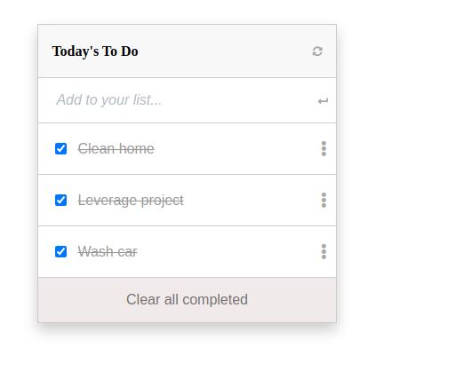

# To Do list: list structure

> Web app for a to-do list

## Built With

- JavaScript.
- HTML.
- CSS.

## Getting Started

To get a local copy up and running follow these simple example steps.

## Live Demo

[Live Link](https://unruffled-bose-3230e7.netlify.app)

## Instructions

To get a local copy up and running follow these simple example steps.

$ cd <folder>

$ git clone git@github.com:PolinaStamenova/to-do-list.git

### Install

- Set up liveserver as an extension in your VS Code.
- If you dont have the live server extension, or are using another software just view directly in your browser.
- npm install

### Usage

- npm start

## Author

👤 **Polina Stamenova**

- GitHub: [@githubhandle](https://github.com/PolinaStamenova)
- LinkedIn: [LinkedIn](https://www.linkedin.com/in/polina-stamenova-a60766112/)

## 🤝 Contributing

Contributions, issues, and feature requests are welcome!

Feel free to check the [issues page](https://github.com/PolinaStamenova/to-do-list/issues).

## Show your support

Give a ⭐️ if you like this project!

## Acknowledgments

- Microverse
- Creative Commons
